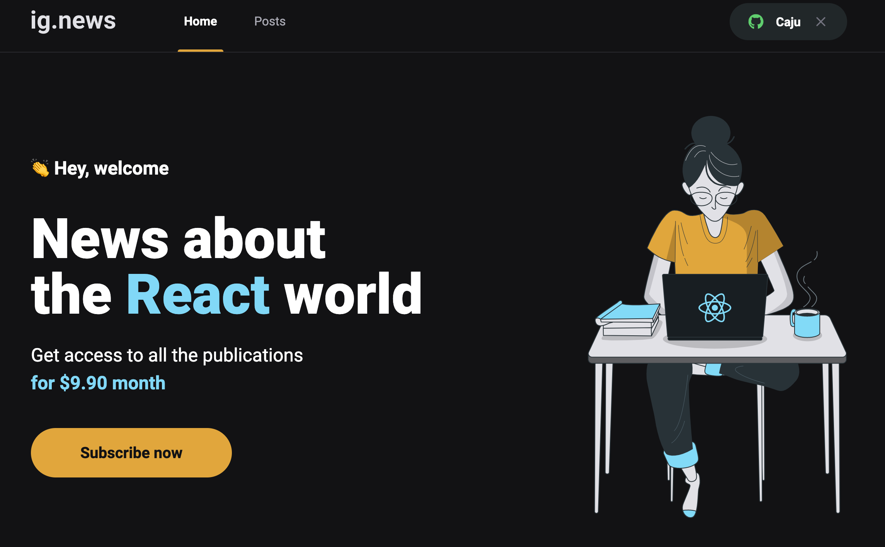

<!-- Info Header -->
<table>
  <tr>
    <td>
      
    </td>
    <td>
      <h3>
        Trilha React Ignite - Rocketseat
      </h3>
      
Curso da Trilha React Ignite - Rocketseat, Aplicação em NextJs.

      

        
        
      

      <p">
        <a href="#telas-do-sistema">Print da API sendo consumida pelo Insomnia:</a>&nbsp;&nbsp;&nbsp;|&nbsp;&nbsp;&nbsp;
        <a href="#descrição">Descrição</a>
      

    </td>
  </tr>
</table>

#### Telas do Sistema

    

    

---

#### Descrição

Curso da Trilha React Ignite - Rocketseat, Aplicação em NextJs.

---

#### Visualizar o projeto na IDE:

Para quem quiser visualizar o projeto na IDE esse recurso do GitHub é bem bacana:

https://github1s.com/alcir-junior-caju/study-js-next-ignite-ignews
